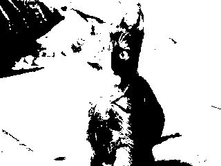
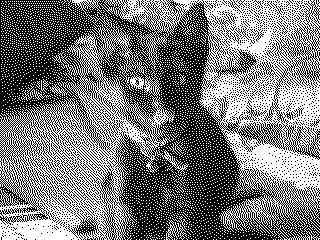
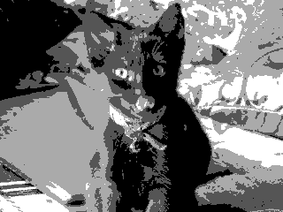
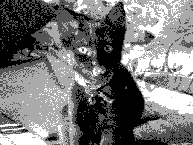

# img_to_py.py

This command line utility converts images to a format used by a [driver](https://github.com/phoreglad/pico-epaper) for
[Waveshare Pico e-Paper 3.7](https://www.waveshare.com/wiki/Pico-ePaper-3.7) display.

# Arguments

## 1. Positional arguments

1. Path to the source image.
2. Path to output file. This is an optional argument, if the target path is not provided the data will be saved to a file
with the same name as source image with extension changed to .py.

## 2. Optional arguments

* --mode, -m -- target image format. L1 (default) for black and white, L2 for 4 level grayscale.
* --preview, -p -- show converted image preview.
* --preview-only -- show converted image preview and exits without saving any data.
* --dither, -d -- use dithering.
* --width -- Set desired target image width.
* --height -- Set desired target image width.

---
**NOTE** If only --width or --height is specified the resulting image will be scaled preserving aspect ratio.
If both are specified the image will be scaled to exact dimensions.

---
* --threshold, -t -- set threshold values for image conversion. Takes one value&nbsp;(v1) in L1
and three&nbsp;(v1,&nbsp;v2,&nbsp;v3) in L2 mode. Relation between threshold values and resulting colours are in the
table below.
This argument has to be used last. Default values: 63, 126, 189.

<div align="center">

| pixel value (px) | result (L1) | result (L2) |
| --- | --- | --- |
| px < v1 | black | black |
| v1 <= px < v2 | white | dark gray |
| v3 <= px < v3 | white | light gray |
| px > v3 | white | white |

</div>


# Example use
### Original image:


### Black and white

```shell
py img_to_py.py test_img\IMG_0182.jpg
```



### Black and white with dithering

```shell
py img_to_py.py -d test_img\IMG_0182.jpg
```



### 4 level grayscale

```shell
py img_to_py.py -m L2 test_img\IMG_0182.jpg
```



### 4 level grayscale with dithering

```shell
py img_to_py.py -m L2 -d test_img\IMG_0182.jpg
```


